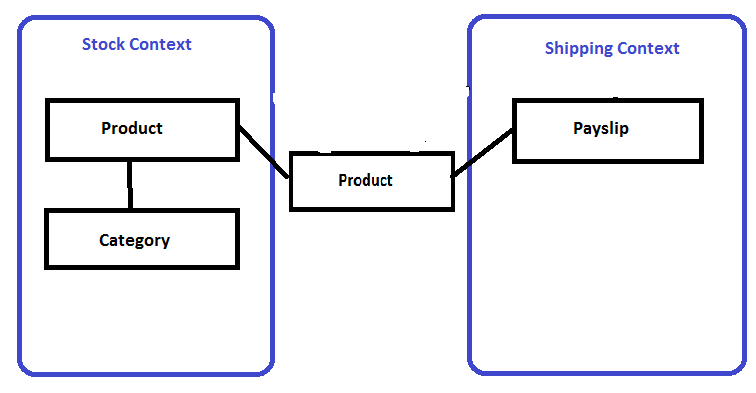

### How to model services
Now that you have learned what are microservices which is small services communicating with each other , you have to know each service should be responsible for a single feature.

Your service should be high cohesive or details defined in each service should be related to each other and they should all generate a single feature

So we can say that microservices apply Single Responsibility principle which states :

> “Gather together those things that change for the same reason, and separate those things that change for different reasons.”

So to model our services, we will apply a generic method that make use of domain driven design.

We should apply following steps (We are speaking in terms of domain driven design):

-   Determines business capabilities
-   Determine our domain models and you can know what is domain model from [here](https://martinfowler.com/eaaCatalog/domainModel.html) 
-   Group these models in larger bounded contexts ( We group them based on business capabilities) and you can know more about bouded context from [here](https://martinfowler.com/bliki/BoundedContext.html)
-   Build service for each bounded context

  

So for example if we have e-commerce our main capabilities will be for example

> 1- Should offer products to the customer

> 2- Should give the ability to buy these products and print payslips

Our domain models will be for example Product , Category , Box , Payslip  

From this we can see that our bounded contexts (with their domain models) are :

> 1- Stock Context (Product / Category)

> 2- Shipping Context (Product / Box )

> 3- Payment Context (Product / Payslip)

  

Note that there is shared model between the three contexts but note that its internal representation inside each context should differ from the external representation which contains shared properties

Now from our defined bounded context we should have services for stock , shipping and payment

But there is a point , our bounded contexts should communicate with each other to make our business , for example shipping context should communicate with stock context to get details about product to be shipped and payment should communicate also with stock context

But how will they communicate that what we will know in the next section